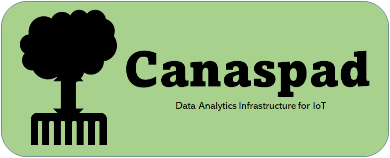

# Canaspad API

Canaspad is a data analytics infrastructure for IoT! 
You can install Canaspad API and Docker Compose in your own Web server and and can send & receive sensing data and control microcontroller.
You can make your home a smart home, install smart agriculture in your greenhouse, check analog gauges with your smartphone, etc.

## Installation
### Install on RaspberryPi
see at https://github.com/spadr/IoT_Frame_RaspberryPi
### Install on x86-64 machine
1. Install Docker Engine on your server
2. Install Docker Compose V1 on your server
3. Git clone this repository
 $ git clone https://github.com/spadr/IoT_Frame_ops.git
4. Move to cloned repository
 $ cd IoT_Frame_ops
5. Rename "env.example" to ".env"
 $ mv .env.example .env
6. Build image and launch each container
 $ sudo docker-compose -f docker-compose.yml up -d --build
7. Check the health of dokcer containers
 $ sudo docker-compose -f docker-compose.yml ps -a
8. Execution of dead/alive monitoring scripts
 $ sudo docker-compose -f docker-compose.yml exec app python manage.py alive_monitoring